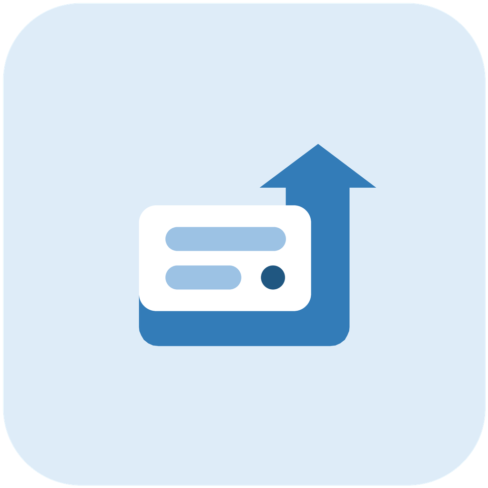

# Status Sync Android

<p align="center">
  
</p>

<p align="center">
  <strong>状态同步</strong>
</p>

<p align="center">
  <a href="docs/README.md">English</a> | 简体中文
</p>

状态同步是一个面向个人主页、仪表盘和状态页的 Android 状态上报应用。应用通过 Shizuku 获取设备状态，在本机预览即将上传的数据，并按用户配置将 JSON 发送到自托管服务器接口。

当前包名为 `com.miafetta.statussync`，当前版本为 `1.2.1`。

## 功能

- 通过 Shizuku 获取设备型号、电池、网络、Wi-Fi、定位和前台应用信息。
- 在首页预览实际上传字段。
- 支持立即上传，也支持按自定义间隔自动同步。
- 支持在设置中配置服务器 API 地址和可选 Bearer 上传密钥。
- 支持展示延迟，例如让主页延迟 5 分钟展示新状态。
- 支持不公开展示，开启后所有上传字段均为 `none`。
- 支持前台应用黑名单/白名单，按应用包名隐藏或仅公开前台应用名称和包名。
- 支持搜索、多选应用，并可选择是否显示系统组件。
- 支持浅色/深色模式，并在 Android 12+ 使用 Material You 动态颜色。
- 使用接近 Shizuku 的 Material 风格界面。

## 系统要求

- Android 12 或更高版本。
- 已安装并启动 Shizuku。
- 已向状态同步授予 Shizuku 授权。
- 一个可以接收 JSON 状态数据的服务器接口。

状态同步不包含后端实现。你需要自行提供 API，并决定如何存储、鉴权和展示上传后的状态数据。

## 数据

应用当前上传以下 JSON 字段：

```json
{
  "model": "设备型号",
  "battery_raw": "电池状态原始输出",
  "wifi_raw": "Wi-Fi 状态信息",
  "net_raw": "蜂窝网络类型",
  "location_raw": "最近定位记录",
  "current_app_package": "当前前台应用包名",
  "current_app_name": "当前前台应用名称"
}
```

本地设置不会作为 JSON 字段上传。不公开展示开启后，上述字段会上传为：

```text
none
```

前台应用过滤只影响 `current_app_package` 和 `current_app_name`。触发黑名单或未命中白名单时，这两个字段会上传为 `none`。

## 服务器 API

默认上传地址为空，需要在应用设置中填写。示例地址：

```text
https://api.yourdomain.com/api/upload_raw
```

应用发送带 JSON 请求体的 `POST` 请求：

```http
POST /api/upload_raw
Content-Type: application/json
Authorization: Bearer <upload-token>
```

上传密钥是可选项。密钥为空时，应用不会添加 `Authorization` 请求头。上传密钥只用于服务器身份认证，不会加密 JSON 请求体。上传敏感状态时请使用 HTTPS，并在服务器侧做好访问控制。

## 构建

克隆仓库后使用 Gradle Wrapper 构建：

```powershell
.\gradlew.bat :app:assembleDebug
```

Debug APK 输出路径：

```text
app/build/outputs/apk/debug/app-debug.apk
```

运行验证：

```powershell
.\gradlew.bat :app:testDebugUnitTest :app:assembleDebug
.\gradlew.bat :app:lintDebug
```

项目已移除 Android Studio 默认示例测试；当前命令用于确认测试任务、资源编译、Kotlin 编译和 lint 均可通过。

## 项目结构

```text
app/src/main/java/com/miafetta/statussync/
  AppSettings.kt             本地设置持久化
  AppPickerActivity.kt       前台应用过滤的应用选择页
  AppToast.kt                系统 Toast 包装
  DeviceStatusCollector.kt   基于 Shizuku 的状态读取和上传 JSON 生成
  MainActivity.kt            首页、数据预览和同步操作
  SettingsActivity.kt        设置页、Shizuku 授权和过滤配置
  StatusSyncApplication.kt   动态颜色初始化
  StatusWorker.kt            后台上传任务
```

## 技术栈

- Kotlin
- Android Jetpack
- Material Components / Material 3
- Shizuku API
- WorkManager
- OkHttp

## 权限

应用声明以下权限：

- `INTERNET`
- `ACCESS_NETWORK_STATE`
- `QUERY_ALL_PACKAGES`

`QUERY_ALL_PACKAGES` 用于在前台应用过滤配置中展示可选择的应用列表。系统状态读取依赖 Shizuku，用户需要主动启动 Shizuku，并明确授予本应用授权。

## 隐私

状态同步会读取并上传原始设备状态，包括设备型号、电池输出、网络状态、前台应用名称和最近定位输出等。开启自动同步前，请先在应用内检查上传数据预览。

请仅上传到你自己控制并信任的服务器。除非已经过滤敏感内容，否则不建议把原始 payload 直接展示到公开页面。

## 许可证

状态同步使用 GNU General Public License v3.0 开源许可证。详情请查看 [LICENSE](LICENSE)。
